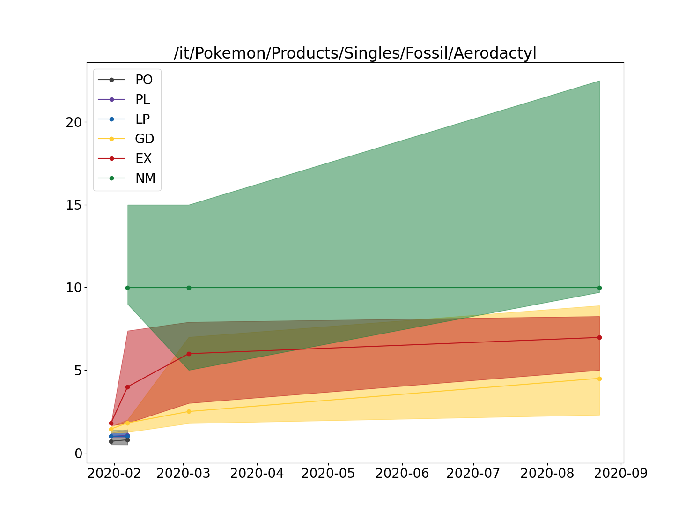

# Warning
Since recently (June 2023) Cardmarked added Cloudflare protection. The old scraping method do not work reliably anymore. 

# A Cardmarket Scraper

A simple cardmarket scraper written in Python.
Original code from 2020, I am doing a bit of refactoring and packing it in a repo. The main work left to do is for data analysis which offered the following functionalities:
1. Price distillation depending on feature (language, condition, etc.)

2. Price tracking in time of article 

3. Find the best seller depending on your needs using a pseudo-knapsack algorithm

# Install
Clone the repo and do `pip install .`

# Using the library
See the examples under the folder `examples/`